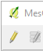
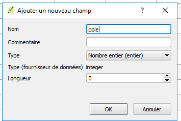

# Mode opératoire d’installation pour VelObs

Ce document décrit la procédure d’installation de VelObs.

L’étape critique correspond à la génération des contours géographiques
utilisés par VelObs pour affecter des observations aux territoires. Ce
document détaille pas à pas la façon de générer ces contours
géographiques pour les communes et les pôles couverts par velObs, en
prenant exemple sur la communauté de communes Montpellier
Méditerranée-Métropole.

## Pré-Requis

- Disposer d’un serveur web public avec

    - PHP (versions testées = 5.4.16, 5.6, 7.0 et 7.3)
    - MySQL (versions testées = TBD) ou MariaDB ( versions testées =
        5.5.47, 10.1.26)
    - phpMyAdmin installé sur le serveur web (optionnel)
    - Accès à un serveur de mail

- QGIS (version testée et recommandée = 2.18.14 (français), utilisé
    pour le traitement des données géographiques,
    https://www.qgis.org/fr/site/.

## Installation

- Récupérer les dernières sources dans
    https://github.com/2p2r/velobs_web/releases
- Décompresser l'archive dans le répertoire voulu sur le serveur de
    production
- Copier le ficher `lib/php/key.php.template` vers `lib/php/key.php`
- Editer le fichier `lib/php/key.php` :

    - définir la constante `DB_HOST` : url et port du serveur MySQL
        (e.g. `localhost:3306`)
    - définir la constante `DB_USER` : login du serveur MySQL
    - définir la constante `DB_PASS` : password du serveur MySQL
    - définir la constante `DB_NAME` : nom de la base de données VelObs
    - définir la constante `URL` : url de l'application
    - définir les constantes `MAIL_*` pour l'envoi des mails de VélObs
    - définir les constantes `VELOBS_*` en fonction des institutions
        avec lesquelles vous travaillez

- Modifier les droits en écriture pour les fichiers/répertoires :

    - `resources/pictures`
    - `resources/icon/marker`
    - `resources/icon/marker/16x18`
    - `resources/css/icon.css`
    - `resources/csv`
    - Commande : `chmod -R 770 resources/pictures resources/icon/marker
        resources/css/icon.css resources/csv`

- Créer une base de données MySQL (ex. velobs) :

    - interclassement : `utf8mb4_unicode_ci`

- Importer le script présent dans resources/sql/install.sql
- Modifier le mot de passe du compte administrateur créé par défaut

    - se connecter à l'interface d'administration de VelObs avec le
        compte “admin” (mot de passe : admin) : `URL_VelObs/admin.php`
    - cliquer sur l'onglet « Mes coordonnées » puis « Modifier mes
        coordonnées »
    - Spécifier un mot de passe et une adresse mail puis cliquer sur
        le bouton « Enregistrer »

        
        

- Copier le fichier `lib/js/key.js.template` vers `lib/js/key.js`
- Editer `lib/js/key.js` si vous souhaitez personnaliser votre
    installation (le `lib/js/key.js.template` sera écrasé à chaque mise à
    jour, pas `lib/js/key.js`):

    - Définir les cartes que vous voulez voir afficher sur l’interface
        publique. Par défaut, 2 cartes sont créées (cf mapnik et
        osmcyclemap), mais vous pouvez en créer d’autres. Il suffit
        ensuite d’ajouter une référence de ces cartes dans le
        tableau « mapLayersArray »
    - modifier la variable `TF_key` : spécifiez votre clé d'API
        thunderforest (clé permettant d’accéder aux tuiles de la carte
        par défaut servies par les serveur thunderforest) dans le cas où
        vous utiliseriez la carte openCycleMap
    - ajouter les clés du fichier `lib/js/translate_fr.js` que vous
        voudriez modifier pour coller à votre association (e.g. :
        `T_header_main` : contenu du panneau supérieur de la page
        principale ou `T_textHowToParticipate` : contenu du pop up
        "comment participer") : cela permet de conserver vos
        modifications lors des mises à jours
    - modifier éventuellement les variables
        `ClusterStrategyNumberOfGroupedObservations` et
        `ClusterStrategyDistance` qui vont influer sur le regroupement
        d’observations sur les cartes publiques et d’administration (1
        seul point affiché regroupant au moins
        `ClusterStrategyNumberOfGroupedObservations` observation proches
        de moins de `ClusterStrategyDistance` pixels)
    - modifier les tableaux `arrayComponentsToDisableRole1Admin`,
        `arrayComponentsToDisableRole2CommunauteCommunes`,
        `arrayComponentsToDisableRole3PoleTechnique` et
        `arrayComponentsToDisableRole4Moderateur` : ces tableaux
        contiennent la liste des champs à désactiver pour chaque rôle
        défini dans la base de données (cf paragraphe m. de ce document
        pour avoir une vue détaillée des rôles). Les identifiants de ces
        champs sont listés ci-dessous avec la correspondance sur
        l’interface d’administration d’une observation

1.  `RuePOIField` : Rue où se trouve l’observation, spécifiée
    initialement par la personne qui a enregistré l’observation
2.  `NumPOIField` : Repère quelconque pour faciliter la localisation
    de l’observation, , spécifié initialement par la personne qui a
    enregistré l’observation
3.  `PrioritePOIField` : Priorité donnée à l’observation par un
    modérateur
4.  `SubCategoryPOIField` : catégorie liée à l’observation, ,
    spécifiée initialement par la personne qui a enregistré
    l’observation
5.  `ObsPOIField` : Observation faite par l’association
6.  `DescPOIField` : Description faite sur l’observation, spécifiée
    initialement par la personne qui a enregistré l’observation
7.  `PropPOIField` : Proposition pour résoudre l’observation,
    spécifiée initialement par la personne qui a enregistré
    l’observation
8.  `RespComcomPOIField` : Réponse de la collectivité
9.  `RespPolePOIField` : Réponse du pôle technique
10. `CommentFinalPOIField` : Commentaire final de l’association
11. `CommunePOIField` : Commune où se trouve l’observation
12. `PolePOIField` : Pôle sur lequel est située l’observation
13. `StatusPOIField` : Statut de l’observation donnée par la
    collectivité
14. `latitude` : latitude de la localisation de l’observation
15. `longitude` : longitude de la localisation de l’observation
16. `ModerationPOIField` : indicateur de l ‘état de modération de
    l’observation
17. `DisplayPOIField` : indicateur d’affichage de l’observation sur la
    carte publique
18. `TraitePolePOIField` : indicateutr de traitement de l’observation
    par le pôle
19. `TransmissionPolePOIField` : indicateur de transmission de
    l’observation de la collectivité au pôle
20. `emailPOIField` : e-mail de la personne qui a enregistré
    l’observation
21. `sendMailButton` : bouton d’envoi de mail à la personne qui a
    enregistré l’observation

    

- Eventuellement, remplacer les logos dans `resources/images` en
    respectant les dimensions

**/!\ Effacez les scripts dans `resources/upgrade/` (scripts uniquement utilisés
pour les mises à jour de VelObs, non nécessaires pour une première
installation).**

- Les étapes suivantes permettent d’adapter les tables mysql
    ci-dessous pour configurer les informations géographiques liées à
    votre instance de VelObs (nécessite quelques compétences en Système
    d'Information Géographique)

    - `commune`: liste des communes caractérisées par leur code INSEE et
        leur contour géographique
    - `pole`: liste des poles caractérisés par leur nom et leur contour
        `géographique`
    - `territoire`: liste des territoires caracterisés par les codes
        INSEE des communes du territoire
    - `configmap`: coordonnées GPS du centre de la carte

### Notion de territoires

Un territoire est un ensemble de communes regroupées dans une entité
géographique reconnue (e.g communauté de communes ou communauté
d’agglomération). Au sein de VelObs, un territoire est défini dans la
table territoire par la concaténation des codes INSEE des commune le
constituant.

### Notion de pôles

Les pôles résultent d'un découpage du territoire. Ce découpage peut
créer les pôles selon des services de voirie, selon des quartiers, selon
des communes en fonction de l’organisation de la collectivité.

En effet, à chaque pôle sont associés des modérateurs en charge de
vérifier, filtrer, modifier les observations remontées par le public,
mais aussi des comptes “Pôles techniques” faisant partie de la
collectivité en charge de traiter les observations sur le terrain.

### Exemples d’implémentations de territoires / pôles en production

#### L’instance de Deux Pieds 2 Roues Toulouse contient 3 territoires :

- Toulouse Métropole constitué de 37 communes, regroupées au sein de 5 pôles
- SICOVAL constitué de 36 communes, regroupées au sein d’un unique pôle
- Muretain constitué de 16 communes, regroupées au sein d’un unique pôle

L’instance de Vélocité Grand Montpellier contient 1 territoire

- Montpellier Méditerranée Métropole constitué de 31 communes,
    regroupées au sein d’un unique pôle

### Trouver les données géographiques

Les contours des communes sont accessibles à partir du site:
[*https://www.data.gouv.fr/fr/datasets/decoupage-administratif-communal-francais-issu-d-openstreetmap/*](https://www.data.gouv.fr/fr/datasets/decoupage-administratif-communal-francais-issu-d-openstreetmap/)
au format shapefile (shp), en projection WGS84 .

Il existe aussi des sources locales. Pour Montpellier Méditerranée
Métropole, le site:
[*http://www.data.montpellier3m.fr*](http://www.data.montpellier3m.fr/)
fournit les contours des quartiers de Montpellier et les contours des
communes de la métropole.

Pour l'exemple on utilisera les données issues d'OpenStreetMap.

Pour importer les données dans VelObs, il faut récupérer la liste des
code INSEE des communes qui vous intéressent (e.g. pour la communauté de
communes de Montpellier Méditerranée-Métropole -
[*https://fr.wikipedia.org/wiki/Montpellier_Méditerranée_Métropole*](https://fr.wikipedia.org/wiki/Montpellier_Méditerranée_Métropole))
:
34172,34022,34027,34057,34058,34077,34087,34088,34090,34095,34116,34120,34123,34129,34134,34164,34169,34179,34198,34202,34217,34227,34244,34249,34256,34680,34270,34295,34307,34327,34337.

### Modèle de la base de données de velObs

L'image suivante représente le modèle de la base de données de velObs.

Les tables colorées contiennent des données géographiques:

- **configmap**: contient les coordonnées GPS du centre de la zone
    couverte par l'application
- **commune**: permet de détecter dans quelle commune est localisée
    une observation
- **pole**: permet de détecter dans quel pôle est localisée une
    observation
- **territoire**: permet de détecter dans quel territoire est
    localisée une observation

On remarquera que les tables **commune** et **pole** contiennent une
colonne de type « geometry ».

Pour l'exemple, on cherchera à peupler la table **commune** avec les
communes constituant la communauté de communes de Montpellier
Méditerranée Métropole et à peupler la table **pole** avec 2 pôles.


### Récupérer les limites des communes

- Depuis la page
    [*https://www.data.gouv.fr/fr/datasets/decoupage-administratif-communal-francais-issu-d-openstreetmap/*](https://www.data.gouv.fr/fr/datasets/decoupage-administratif-communal-francais-issu-d-openstreetmap/),
    paragraphe Ressources, télécharger le fichier shapefile (.shp) le
    plus récent, e.g. [*Export simple de janvier
    2017*](http://osm13.openstreetmap.fr/~cquest/openfla/export/communes-20170111-shp.zip)
    (224Mo)
- Dézipper le fichier téléchargé. Le fichier principal contenant les
    coordonnées des communes se nomme `communes-AAAAMMJJ.shp` (les autres
    fichiers doivent aussi être présents aux côtés du fichier `.shp`)

### Importer les limites des communes dans QGIS

- Ouvrir QGIS
- Cliquer sur Couche &gt; Ajouter une couche &gt; Ajouter une couche
    vecteur

    

- Sélectionner “Fichier”, codage = “UTF-8” et dans “Jeu de données”,
    aller chercher le fichier `communes-AAAAMMJJ.shp`

    

- Cliquer sur le bouton Ouvrir
- Toutes les communes françaises sont affichées

1.  a. Sélection des communes d’intérêt

- ouvrir le menu couche &gt; Propriétés &gt; Général
- cliquer sur le bouton “Constructeur de requête” en bas à droite de
    la fenêtre des propriétés
- dans le constructeur de requête, nous allons créer la requête
    permettant de ne conserver que les communes qui font partie de la
    liste des codes INSEE, qu’on va spécifier

    - double cliquer sur le champ “insee” : “insee” doit apparaître
        dans le champ “Expression de filtrage spécifique au fournisseur
        de données”
    - cliquer sur le bouton IN
    - taper sur la touche `(`
    - coller la liste des codes INSEE des communes qui vous
        intéressent. Chaque code doit être délimité par une apostrophe
        et les codes sont séparées par une virgule (e.g.
        `'34172','34022','34027','34057','34058','34077','34087','34088','34090','34095','34116','34120','34123','34129','34134','34164','34169','34179','34198','34202','34217','34227','34244','34249','34256','34680','34270','34295','34307','34327','34337'`)
    - taper sur la touche `)`
    - Au final, la requête doit ressembler à :

        - `"insee" IN
            ('34172','34022','34027','34057','34058','34077','34087','34088','34090','34095','34116','34120','34123','34129','34134','34164','34169','34179','34198','34202','34217','34227','34244','34249','34256','34680','34270','34295','34307','34327','34337')`

    - Cliquer sur le bouton Tester &gt; une fenêtre indiquant le
        nombre de lignes trouvées s’affiche. Cela doit correspondre au
        nombre de communes constituant la communauté de communes

        

- Cliquer sur OK dans la fenêtre de “Résultat de requête”
- Cliquer sur OK dans la fenêtre de “Constructeur de requête”
- Cliquer sur OK dans la fenêtre de “Propriétés de la couche” &gt;
    Seules les communes sélectionnées sont désormais affichées...en tout
    petit
- Cliquer sur le bouton “Zoom sur la couche” pour afficher les
    communes sélectionnées avec un zoom correct

    
    
- Enregistrement des fichiers nécessaires à l’import des communes dans
    VelObs :

    - Cliquer sur le menu “Couche” &gt; “Enregistrer sous...”

        - Format : ESRI Shapefile
        - FileName : Parcourir vers l’endroit souhaité et donner le
            nom MesCommunes.shp
        - Codage : UTF-8
        - Cliquer sur le bouton OK
        - Une nouvelle entrée nommée “MesCommunes” apparaît dans le
            sélecteur de couches en bas à gauche de QGIS, et est
            sélectionnée par défaut :

            

    - Cliquer sur le menu “Couche” &gt; “Enregistrer sous...”

        - Format : Valeurs séparées par une virgule \[CSV\]
        - FileName : Parcourir vers l’endroit souhaité et donner le
            nom MesCommunes.csv
        - Codage : UTF-8
        - Cliquer sur le bouton OK
        - Une nouvelle entrée nommée “MesCommunes” avec un icône de
            tableau, apparaît dans le sélecteur de couches en bas à
            gauche de QGIS, et est sélectionnée par défaut
        - Sélectionner la couche MesCommunes avec la croix et le carré
            (couche de vecteurs qui nous intéresse)

### Création des pôles

On part du principe que les pôles correspondent à un regroupement de
communes. Nous allons ajouter un attribut à la couche des communes pour
leur affecter un numéro de pôle.

NOTA : si toutes les communes sont situées dans un unique pôle, aller à
l’étape “Créer les contours des pôles”

- ouvrir le menu “Couche” &gt; “Ouvrir la table d’Attributs”
- cliquer sur le bouton d’édition

    

- Cliquer sur le bouton “Ajouter un champ”

    

    - dans le champ “Nom”, écrire “pole”
    - cliquer sur le bouton OK
    
        

- Cliquer sur le bouton d’édition pour enregistrer
- tout en laissant la fenêtre des attributs ouverte, cliquer, dans le
    menu principal, sur le bouton  permettant de sélectionner des entités

    - sur la carte, cliquer sur les communes faisant partie d’un même
        pôle pour les sélectionner tout en maintenant la touche Ctrl
        enfoncée : les communes sélectionnées apparaissent en jaune sur
        la carte et dans la table des attributs :

        

- Dans la table des attributs, on va mettre à jour le champ “pole”
    pour toutes les communes sélectionnées :

    - dans le sélecteur de champs, sélectionner “pole”
    - mettre le numéro du pôle dans le champ libre
    - cliquer sur le bouton “Mettre à jour la sélection”

        

Faire de même pour tous les pôles.

- Au final, la vue tabulaire (boutons en bas à droite de la fenêtre
    d’attributs pour basculer de la vue formulaire à la vue tabulaire)
    devrait ressembler à

    

- Cliquer sur le bouton d’édition puis sur le bouton Enregistrer pour
    enregistrer les modifications
- Fermer la fenêtre des attributs

<!-- -->

#### Créer les contours des pôles

- S’il y a plusieurs pôles

    - Sélectionner toutes les communes (Ctrl+A) : toutes les
        communes doivent être en jaune
    - Cliquer sur le menu “Vecteur” &gt; “Outils de
        géotraitement” &gt; “Dissolve”
    - Décocher la checkbox “Dissolve all”
    - Faire passer le champ “pole” dans “Selected” (les contours
        des communes avec un même numéro de pôle seront fusionnés)
    - Cliquer sur le bouton “...” et sélectionner
        l’option”Enregistrer dans un fichier” + fichier de type
        SHP + codage = UTF-8

        

- S’il n’y a qu’un seul pôle

    - Sélectionner toutes les communes (Ctrl+A) : toutes les communes
        doivent être en jaune
    - Cliquer sur le menu “Vecteur” &gt; “Outils de géotraitement” &gt;
        “Dissolve”
    - Cliquer sur le bouton “...” et sélectionner l’option”Enregistrer
        dans un fichier” + fichier de type SHP + codage = UTF-8 et donner le
        nom “MesPoles.shp”

- Cliquer sur le bouton Run
- Le ou les pôles s’affichent. L’exemple suivant montre 2 pôles :

    

- Enregistrement des fichiers nécessaires à l’import des pôles dans
    VelObs :

  - Cliquer sur le menu “Couche” &gt; “Enregistrer sous...”

    - Format : Valeurs séparées par une virgule \[CSV\]
    - FileName : Parcourir vers l’endroit souhaité et donner le
        nom `MesPoles.csv`
    - Codage : UTF-8
    - Cliquer sur le bouton OK

  - Le fichier shapefile a déjà été enregistré à l’étape précédente

### Importer les données géographiques dans velObs

À cette étape, nous disposons de 4 fichiers à importer dans la base de
données de VelObs:

- `MesCommunes.csv` et `MesCommunes.shp` pour les communes
- `MesPoles.csv` et MesPoles.shp pour les pôles

- Modifier le fichier `MesPoles.csv` avec un éditeur de texte basique,
    de façon à pouvoir mettre à jour le nom des pôles :

    - la colonne “nom” sera reprise dans la colonne
        “pole”.”lib_pole”, affichée dans VelObs

- Ouvrir PhpMyAdmin et faire un backup de la base de données de VelObs
    puis
- Sélectionner la base de données de Velobs
- Cliquer sur le menu Importer

    - Sélectionner le fichier MesCommunes.csv
    - S’assurer que le jeu de caractères est bien sur UTF-8
    - Sélectionner la checkbox “La première du fichier contient le nom
        des colonnes de la table”
    - Cliquer sur Exécuter

        

- PhpMyAdmin a créé une table avec un nom générique “TABLE XX” et
    enregistré les communes exportées via QGIS :

    

- Importer de la même façon le fichier MesCommunes.shp (pas d’option à
    configurer), `MesPoles.csv` (jeu de caractères = UTF-8 et cocher “La
    première ligne du fichier contient le nom des colonnes de la table”)
    et MesPoles.shp (dans cet ordre)
- Bien repérer quelle table correspond à quel fichier
- Dans mon cas

    - MesCommunes.csv = TABLE 21
    - MesCommunes.shp = TABLE 22
    - MesPoles.csv = TABLE 23
    - MesPoles.shp = TABLE 24

    

- renommer les tables pour plus de clarté et de facilité pour la suite :
```sql
RENAME TABLE `TABLE 21` TO mes_communes_csv;
RENAME TABLE `TABLE 22` TO mes_communes_shp;
RENAME TABLE `TABLE 23` TO mes_poles_csv;
RENAME TABLE `TABLE 24` TO mes_poles_shp;
```
- Ajouter un index autoincrémenté, id, à chaque table nouvellement
    créée, ce qui permettra de refaire la jointure entre données
    spatiales et les attributs
```sql
ALTER TABLE mes_communes_csv ADD `id` SERIAL NOT NULL;
ALTER TABLE mes_communes_shp ADD `id` SERIAL NOT NULL;
ALTER TABLE mes_poles_csv ADD `id` SERIAL NOT NULL;
ALTER TABLE mes_poles_shp ADD `id` SERIAL NOT NULL;
```
Créer l’enregistrement dans la table “territoire” (besoin de
id_territoire dans la requête de création des pôles à suivre). la
colonne ids_territoire doit contenir la liste des codes INSEE des
communes constituant le territoire, séparés par un “;” :
```sql
INSERT INTO `territoire` (`lib_territoire`,
    `type_territoire`, `ids_territoire`) VALUES ( 'Montpellier
    Méditerranée Métropole', 0,
    '34172;34022;34027;34057;34058;34077;34087;34088;34090;34095;34116;34120;34123;34129;34134;34164;34169;34179;34198;34202;34217;34227;34244;34249;34256;34680;34270;34295;34307;34327;34337');
```
- récupérer l'identifiant (id_territoire) de la table territoire
    correspondant à “'Montpellier Méditerranée Métropole” (normalement,
    c’est 1 s’il n’y a qu’un seul territoire)

Les requêtes suivantes permettent de peupler les tables “commune” et
“pole” de VelObs :
```sql
INSERT INTO `commune`(`id_commune`, `lib_commune`,
    `geom_commune`) SELECT mes_communes_csv.insee,
    mes_communes_csv.nom, mes_communes_shp .`SPATIAL` FROM
    mes_communes_shp INNER JOIN mes_communes_csv WHERE
    mes_communes_csv.id =mes_communes_shp.id;
```
- dans la requête SQL suivante, remplacer **ID_TERRITOIRE ** par
    l'identifiant (id_territoire) de la table territoires correspondant
    à “'Montpellier Méditerranée Métropole”
```sql
INSERT INTO `pole`( `lib_pole`, `geom_pole`,
    `**territoire_id_territoire**`) SELECT mes_poles_csv.nom,
    mes_poles_shp.`SPATIAL`, **ID_TERRITOIRE ** FROM
    mes_poles_shp INNER JOIN mes_poles_csv WHERE mes_poles_csv.id
    =mes_poles_shp.id;
```
Après validation de la bonne réalisation des manipulations (aller sur le
frontend de velobs et faire afficher les contours des communes et des
pôles par exemple), les tables `mes_communes_csv` , `mes_communes_shp`,
`mes_poles_csv` et `mes_poles_shp` peuvent être supprimées.

### Déterminer le centre de la carte par défaut

- Ouvrir la page
    [*http://www.openstreetmap.org*](http://www.openstreetmap.org/)
- Afficher la carte comme on veut que VelObs s’ouvre par défaut (e.g.
    ci-dessous : centre de Montpellier)
- Récupérer la latitude et la longitude dans la barre d’adresse

    

- Modifier la requête suivante et l’exécuter dans phpMyAdmin
```sql
INSERT INTO `configmap` (`id_configmap`,
        `lat_configmap`, `lon_configmap`, `zoom_configmap`,
        `baselayer_configmap`) VALUES (**1**, **LATITUDE**,
        **LONGITUDE**, **13**, **0**);
```
- Le centre de la carte pour VelObs est maintenant configuré

### Tester l’envoi de mail

- Créer une observation à partir de l’interface publique de velObs (cf
    [documentation_utilisateurs.md](documentation_utilisateurs.md#soumettre-une-observation)) : un mail doit être envoyé à
    l’adresse e-mail de la personne qui enregistre l’observation (ne pas
    utiliser la même adresse e-mail que celle de l’administrateur sinon
    aucun mail n’est envoyé et l’observation est modérée par défaut),
    ainsi qu’à l’administrateur
- Si le mail n’a pas été envoyé, déterminer la cause de l’échec et
    corriger

### Créer des utilisateurs

- se connecter à l'interface d'administration de VelObs avec le compte
    admin : `URL_VelObs/admin.php`
- cliquer sur le menu Utilisateurs &gt; Ajouter un utilisateur
- La fenêtre suivante s’ouvre

    

- Remplir le formulaire

    - Rôle à choisir parmi :

        - Administrateur
        - Communauté de communes
        - Pôle technique
        - Responsable pôle modérateur

Un compte avec le rôle d’administrateur a les droits les plus étendus
sur l’instance de VelObs :

- création/modification d’utilisateurs
- création/modification de statuts
- création/modification de priorités
- modération de toutes les observations présentes dans l’instance
    VelObs (consulter le document [documentation_utilisateurs.md](documentation_utilisateurs.md#modérer-et-suivre-des-observations)
    pour plus de détails sur la modération)

Un compte avec le rôle « Responsable pôle modérateur » :

- accède à toutes les observations enregistrées sur le territoire du
    pôle auquel il est associé
- peut modérer toutes ces observations (en fonction de la priorité
    donnée à l’observation, elle est transférée aux comptes « Communauté
    de communes »  du territoire correspondant

Un compte avec le rôle « Communauté de communes »  :

- a accès à toutes les observations déclarées sur le territoire
    correspondant et modérées positivement par l’association
- peut donner un statut aux observations et associer un commentaire
- peut transférer les observations de son choix aux pôles techniques

Un compte avec le rôle « Pôle technique »  :

- a accès à toutes les observations déclarées sur le territoire
    associé au pôle et qui ont été transférées par un compte
    « Communauté de communes »
- peut préciser si l’observation a été traité et peut ajouter un
    commentaire

- Pôle à choisir parmi :

    - Administrateur ou Comcom
    - liste des pôles définis aux étapes précédentes

- Territoire à choisir parmi

    - Zone couverte par VelObs
    - liste des territoires définis aux étapes précédentes

- Cohérence des informations :

    - si rôle = “Administrateur” alors choisir Pôle =
            “Administrateur ou Comcom” et Territoire = “Zone couverte
            par VelObs”
    - si rôle = “Communauté de communes” alors choisir Pôle =
            “Administrateur ou Comcom” et Territoire = territoire
            associé à la communauté de communes
    - si rôle = “Pôle technique” alors choisir Pôle = pôle
            correspondant au compte et Territoire = territoire associé à
            la communauté de communes du pôle
    - si rôle = “Responsable pôle modérateur” alors choisir Pôle =
            pôle correspondant au compte et Territoire = territoire
            associé à la communauté de communes du pôle où opère le
            modérateur

    - les autres combinaisons devront être testées : à l’heure
        actuelle 1 compte ne peut être associé qu’à 1 pôle et 1
        territoire

- Cliquer sur le bouton Enregistrer

    - un mail automatique est envoyé à l’adresse e-mail associée au
        compte avec les informations de connexion

### Gestion des priorités

Une priorité est affectée à une observation par les modérateurs de
velObs. Les priorités servent à filtrer les observations.

Dans la version de Velobs de base, les priorités suivantes existent par
défaut :

1 : Priorité 1\
2 : Priorité 2\
4 : A modérer\
6 : Clôturé\
7 : Refusé par l'association : non affiché sur l'interface publique\
8 : Urgence : non affiché sur l'interface publique\
12 : Refusé par la collectivité\
15 : Doublon

Pour modifier les priorités :

- se connecter à l'interface d'administration de VelObs avec un compte
    ayant le rôle administrateur : `URL_VelObs/admin.php`
- cliquer sur le menu “Observations“ &gt; “Priorités”
- le tableau des priorités apparaît :

    

- Tous les champs (hormis l’identifiant) sont modifiables

    - pour les champs texte : double-cliquer sur le champ à modifier
        et donner le nouveau texte. Cliquer ailleurs dans l’interface
        pour enregistrer automatiquement la nouvelle valeur
    - Pour les cases à cocher : le fait de cocher ou décocher un champ
        enregistre automatiquement la modification sur le serveur

- Explication des champs :

    - Colonne « Libellé » : libellé de la priorité, affichée dans les
        boîtes de sélection des observations
    - Colonnes « e-mail » (Sujet et corps) : quand un modérateur
        modifie la priorité affectée à une observation, un mail est
        envoyé à la personne qui a soumis l’observation. Les sujets et
        corps de ce mail sont définis à cet endroit. Le marqueur
        `#VELOBS_ASSOCIATION#` est remplacé à la volée par la valeur de
        la variable `VELOBS_ASSOCIATION` définie dans le fichier `key.php`.
        A ce corps de mail est ajouté systématiquement les informations
        liées à l’observation ainsi que celles ayant été modifiées lors
        de l’enregistrement de l’observation.
    - Colonne « Nécessite un commentaire de l’association » : quand un
        modérateur modifie la priorité affectée à une observation, si ce
        champ est coché pour ladite priorité, le modérateur sera obligé
        de spécifier un commentaire avant enregistrement...afin que la
        personne qui recevra le mail soit correctement informée
    - Colonne « Non visible sur l’interface publique » : les
        observations dont la priorité est configurée pour être non
        visible sur l’interface publique….n’apparaîtront pas sur la
        carte publique
    - Colonne « Non visible par les comptes des collectivités » : les
        observations dont la priorité est configurée pour être non
        visible par les comptes des collectivités….n’apparaîtront pas
        sur leur interface d’administration, l’idée étant de ne leur
        afficher que les observations qu’ils ont à traiter, sans les
        polluer

### Gestion des statuts

Un statut est affecté à une observation par les comptes des
collectivités de velObs. Les statuts servent à filtrer les observations
sur l’interface publique notamment. Aucun traitement spécifique n’est
effectué, on peut donc modifier les libellés existants et/ou rajouter de
nouveaux statuts. Une couleur est associée à chaque statut. Cette
couleur est utilisée pour afficher les statistiques du nombre
d’observation par statut en haut de page (cf ci-dessous) mais aussi pour
affecter la couleur de l’ombre aux icônes des observations sur les
cartes, permettant d’un coupe d’œil de connaître le statut des
observations affichées :


Dans les versions 1.4 et ultérieures de Velobs, les statuts suivants
existent par défaut :


Pour modifier les libellé,couleur et état d’un statut :

- se connecter à l'interface d'administration de VelObs avec un compte
    ayant le rôle administrateur : `URL_VelObs/admin.php`
- cliquer sur le menu “Observations”&gt;“Statuts”
- double-cliquer sur le libellé à modifier et donner le nouveau
    libellé
- double-cliquer sur la couleur à modifier et donner une nouvelle
    couleur

    - cliquer ailleurs dans l’interface pour enregistrer
        automatiquement la nouvelle valeur

- Cliquer dans la case « Actif » pour activé / désactiver le statut
    correspondant

Pour ajouter un nouveau statut, il faut cliquer sur le menu « Ajouter un
statut »

Pour rajouter une couleur prédéfinie (rouge, vert, bleue et noir par
défaut), il faut suivre les instructions dans le fichier
`key.js.template`.

### Gestion des catégories et des sous-catégories

Les observations sont liées à une (et une seule) sous-catégorie. Une
sous-catégorie est liée à une seule catégorie.

Ces catégories/sous-catégories permettent de filtrer les observation
affichées sur l’interface publique.

Dans les versions 1.4 et ultérieures de VelObs, les catégorie et
sous-catégories suivantes existent par défaut :


On peut imaginer des catégories Cycliste et Piéton pour classer les
observations en fonction de ces types par exemple. On peut créer une
catégorie pour mettre l’accent sur une certaine sous-catégorie, exemple
à Toulouse où un accent a été mis temporairement pour une campagne de
référencement pour l’ajout de supports vélos :


Pour modifier les libellés des catégories et sous-catégories :

- se connecter à l'interface d'administration de VelObs avec un compte
    ayant le rôle administrateur : `URL_VelObs/admin.php`
- cliquer sur le menu “Catégories” ou “”Sous-catégories”
- double-cliquer sur le libellé à modifier et donner le nouveau
    libellé
- cliquer ailleurs dans l’interface pour enregistrer automatiquement
    la nouvelle valeur

Pour ajouter une nouvelle catégorie ou sous-catégorie, sur l’interface
de gestion des catégories, cliquer sur “Ajouter une catégorie”, ou sur
l’interface de gestion des sous-catégories, cliquer sur “Ajouter une
sous-catégorie”

Les icônes des catégories et sous-catégories sont modifiables., vous
pouvez en ajouter de nouvelles :

### Gestion des icônes

Dans les versions 1.4 et ultérieures de VelObs, les icônes suivantes
existent par défaut :


Pour ajouter une nouvelle icône :

- cliquer sur « Configuration » (en haut à droite)
- cliquer sur “Ajouter une icône”.

    - Donner le chemin vers votre icône (l’icône ajoutée doit avoir un
        format de 32 pixels de large sur 37 pixels de hauteur et ne pas
        dépasser 50ko (le plus petits ils sont le mieux c’est : les
        icônes actuelles pèsent environ 2ko))
    - charger l’icône

- cliquer dans le champ « Libellé » de votre icône qui a dû apparaître
    dans la liste des icônes et spécifier le libellé

Cette icône est maintenant utilisable pour les catégories et
sous-catégories.

### Suivi de version
| Objet de la révision                                                                                                                                                                                        | Auteur                                           | Date         |
|-------------------------------------------------------------------------------------------------------------------------------------------------------------------------------------------------------------|--------------------------------------------------|--------------|
| Passage en markdown pour une meilleure accessibilité                                                                                                                                                               | Johan Dufour (johan.dufour@gmail.com)            | 12/04/2019   |
| Mise à jour captures d’écran et mode opératoire pour correspondre aux nouveautés de la version 1.6.2 de VelObs                                                                                              | Gérald salin (gerald.salin@gmail.com)            | 12/02/2019   |
| Modification «Editer lib/js/key.js » avec l’ajout de la configuration des champs désactivable par rôle                                                                                                      | Gérald salin (gerald.salin@gmail.com)            | 29/04/2018   |
| Modification du paragraphe sur la configuration des statuts                                                                                                                                                 |                                                  |              |
| Modification du paragraphe sur la configuration des priorités                                                                                                                                               |                                                  |              |
| Ajout ligne « suppression des scripts resources/upgrade »                                                                                                                                                   |                                                  |              |
| Remplacement interclassement mysql de utf8 par utf8mb4_unicode_ci                                                                                                                                           | Gérald salin (gerald.salin@gmail.com)            | 28/01/2018   |
| Ajout « Editer lib/js/key.js en ajoutant »                                                                                                                                                                  |                                                  |              |
| Création fichier INSTALL.odt fusionnant la documentation de Lydie et le README de Théo/Fabien pour avoir un  fichier unique lié à l’installation. Reprise de ces documentations pour donner plus de détails | Gérald salin (gerald.salin@gmail.com)            | 21/11/2017   |
| Version initiale sur la gestion des contours géographiques                                                                                                                                                  | Lydie Desperben (lydie.desperben@wanadoo.fr )    | Juillet 2017 |
| Transposition de la procédure d’installation des fichiers textes dans le README sur GitHub                                                                                                                  | Théophile Rascagnères (theophile@inventati.org ) | 14/11/2016   |
| Version initiale de la procédure d’installation dans fichiers texte dans les sources                                                                                                                        | Fabien Goblet                                    | 2015         |dans fichiers texte dans les sources                                                                                                                        | Fabien Goblet                                    | 2015         |
