# Documentation utilisateurs

## Qu’est-ce que VelObs ?

**VelObs**, est un outil qui permet aux cyclistes de signaler les problèmes
et de proposer des améliorations sur le réseau cyclable. **VelObs** est
développé depuis 2009 par l’association toulousaine 2 pieds 2 roues.
Depuis 2016, les sources de **VelObs** sont en libre accès sur github :
[https://github.com/2p2r/velobs_web](https://github.com/2p2r/velobs_web).

C'est une carte en ligne, où n'importe quel cycliste peut faire des
observations, idéalement, accompagnées d'une photo (plus de chance
d’être traitées efficacement).

Toutes les fiches modérées positivement sont affichées sur l’interface
publique sous la forme d’une icône associée à une catégorie. Il suffit
de cliquer sur une icône pour afficher les détails :

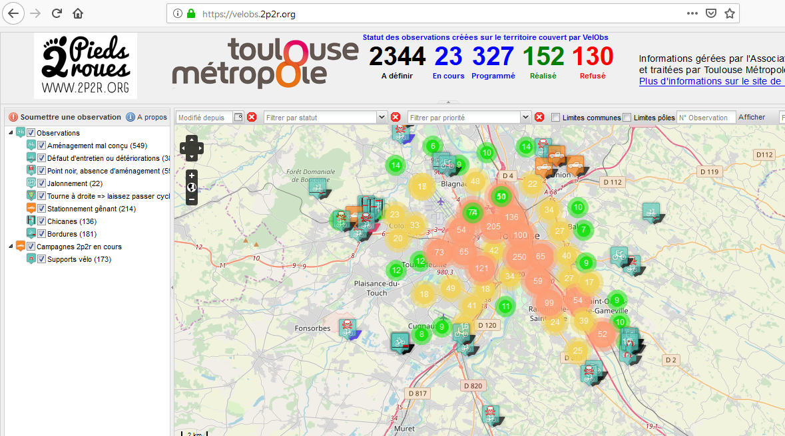

## Liste des instances de VelObs

- Toulouse Métropole, SICOVAL, Muretain :
    [http://velobs.2p2r.org/](http://velobs.2p2r.org/)*, 
    [application android](https://play.google.com/store/apps/details?id=org.deuxpiedsdeuxroues.velobs.tlse)*
    (février 2018)
- Montpellier : <http://velobs.velocite-montpellier.fr/> (octobre 2017)
- Pays d’Aix : <http://adava.fr/velobs/> (avril 2018), 
    [application android](https://play.google.com/store/apps/details?id=org.deuxpiedsdeuxroues.velobs.aix)
    (avril 2018)
- Les Ardennes : <https://velobs08.ouvaton.org/> (mai 2018),
    [application android](https://play.google.com/store/apps/details?id=org.deuxpiedsdeuxroues.velobs.mvav)
    (mai 2018)
- Lyon : en cours de test (<https://lavilleavelo.org/velobs/>)

## Accéder à une observation

### Via la carte
- Ouvrir l’instance de **VelObs** correspondant à la ville ci-dessus
- se déplacer sur la carte à l’endroit où se trouve l’observation que vous cherchez
    - utiliser les contrôles suivants pour déplacer/zoomer

        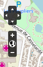 
    
    - utiliser la souris pour se déplacer (clic
        enfoncé et déplacement souris), et zoomer (double-clic pour
        zoomer)

### Connaissant son numéro
- spécifier le numéro de l’observation dans le champ « N°
    Observation à afficher» dans le bandeau du bas puis appuyer sur
    la touche Entrée.

    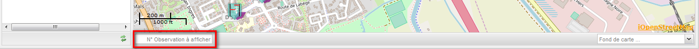

Il existe plusieurs moyens pour récupérer le numéro d’une observation :

- au survol de l’icône correspondant à une observation, une bulle
    s’affiche avec le numéro et le lien vers la fiche de l’observation
    (pour envoyer aux collègues par mail, aux collectivité pour traiter
    un point précis...)
- en ouvrant une observation, le numéro de celle-ci
    s’affiche dans la barre de titre en haut à gauche

    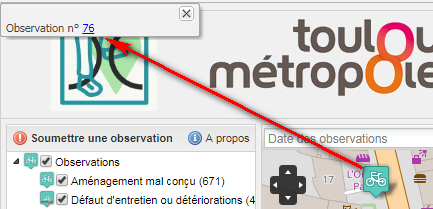

- le numéro d’une observation se trouve aussi dans les mails
    automatiques envoyés lors de la création, puis de la modification de
    cette fiche.

## Soumettre une observation

N’importe qui peut ajouter une observation à **VelObs**, adhérent comme non
adhérent. Pour ajouter une observation :

- Ouvrir l’instance de **VelObs** correspondant à la ville ci-dessus
- se déplacer sur la carte à l’endroit où vous voulez soumettre une
    observation et modifiez le zoom pour bien visualiser la position (en
    utilisant les boutons de zoom ou le double-clic de la souris)
- Vérifier qu’il n’existe pas déjà une observation référençant le même
    problème

    - sélectionner toutes les catégories dans le menu de gauche pour
        afficher toutes les observation non clôturées
    - S’il existe déjà une observation identique,

        - il est possible d’ajouter un commentaire assorti d’une photo
            si vous l’estimez nécessaire en cliquant sur le bouton
            « Ajouter un commentaire et/ou une photo » de la fiche
            suivante
        - il est également possible de voter pour cette observation
            pour lui donner plus de poids et pour être tenu informé des
            évolutions de cette observation (optionnel) en cliquant sur
            le bouton « Voter pour cette observation» de la fiche
            suivante

            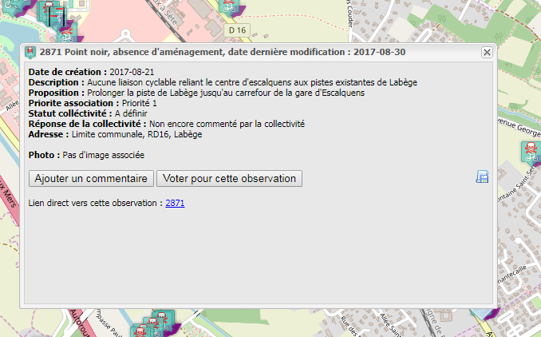

    - si aucune observation n’existe, on peut la créer

- Cliquer sur le bouton “Soumettre une observation” dans le menu de
    gauche

    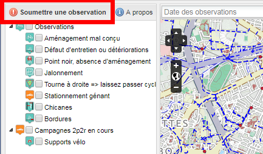

- Positionner aussi précisément que possible (n’hésitez pas à zoomer)
    le marqueur correspondant à votre observation en cliquant sur la
    carte. Le marqueur peut-être déplacé après sa création en
    cliquant/déplaçant ou en cliquant de nouveau sur la carte

    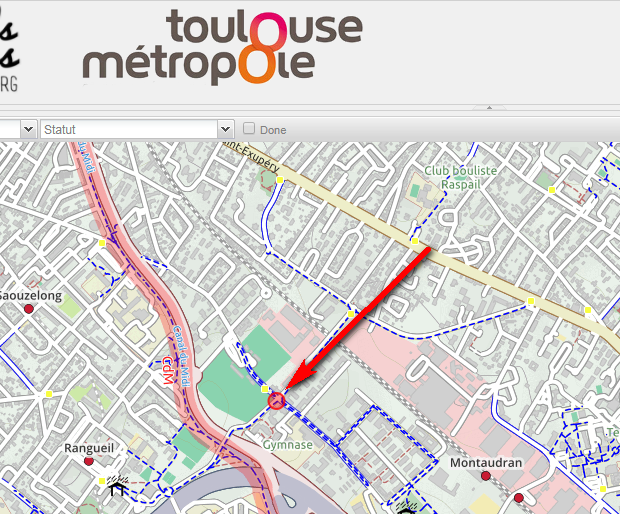

> **Note :** le numéro et le nom de la rue correspondant peuvent être
récupérés automatiquement via le service institutionnel
<https://api-adresse.data.gouv.fr/reverse> pour pré-remplir le champ
« Nom de la voie ».

- Renseigner aussi précisément que possible les informations demandées
    dans le formulaire qui s’affiche à droite

    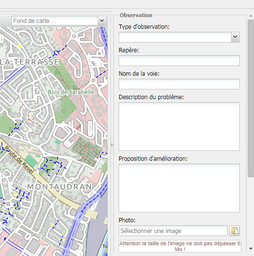

- Dans le bloc “Vos coordonnées”, seule l’adresse e-mail est obligatoire

    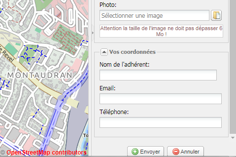

- Cliquer sur le bouton “Envoyer”

> **Note :** les observations faites avec le mail d’un modérateur ou d’une
modératrice sont modérés automatiquement, en “Priorité 1”

> *A noter : Vélo-Cités (association FUB montpelliéraine) a fait un petit
tutoriel en ligne [https://huit.re/VelobsTuto](https://huit.re/VelobsTuto).*

L’observation **VelObs** est créée. Un courriel est automatiquement envoyé
aux modérateurs et aux administrateurs de l’association qui gère **VelObs**,
ainsi qu’à la personne qui a enregistré l’observation.

Un modérateur est associé à un pôle, correspondant à une zone
géographique précise, définie dans **VelObs**. Par exemple, pour Toulouse
Métropole, ces pôles correspondent aux aires géographiques
correspondants à la compétence territoriale d’une équipe “Voirie”.

Après modération, les observations sont affichées sur l’interface
publique de **VelObs** et mises à disposition de la collectivité dans son
interface d’administration (sauf pour les urgences où un numéro de
téléphone est donné à l’utilisateur, celles qui sont refusées par
l’association ou qui sont en doublon).

La collectivité peut répondre et prendre en compte les observations pour
les futurs aménagements ou refuser l’observation.

Les modérateurs bénévoles de l'association sont invités à surveiller
régulièrement sur place l'évolution des observations et à marquer les
observations comme résolues le cas échéant. N’importe quel cycliste a la
possibilité d’ouvrir une fiche **VelObs** sur l’interface publique et
d’ajouter un commentaire, agrémenté d’une photographie, pour mettre à
jour la fiche. Ce commentaire est modéré de la même façon qu’une
observation.

### Filtrer les observations sur la carte publique et d’administration

Il est possible de filtrer les observations affichées sur la carte si on
est intéressé pour avoir un sous-ensemble de celles-ci. Par exemple :

- en tant que Collectivité, je peux être intéressé pour n’afficher que
    les observations dont le statut est à « A définir »
- en tant que Modérateur, je peux être intéressé pour n’afficher que
    les observations qui ont la priorité positionnée à « A modérer », ou
    n’afficher que les observations qui ont des commentaires en attente
    de modération

Pour ce faire des filtres ont été ajoutés sur la carte (attention, tous
les filtres se cumulent, se référer aux numéros dans la capture d’écran
ci-dessous) :

1. Catégories/sous-catégories : n’affiche que les observations
  correspondantes
2. Modifié depuis : n’affiche que les observations qui ont été
  modifiées une date à spécifier
3. Statut : n’affiche que les observations qui ont le statut
  spécifié
4. Priorité: n’affiche que les observations qui ont la priorité
  spécifiée
5. Nombre de votes : n’affiche que les observations qui ont un
  nombre de vote supérieur ou égal au chiffre spécifié

    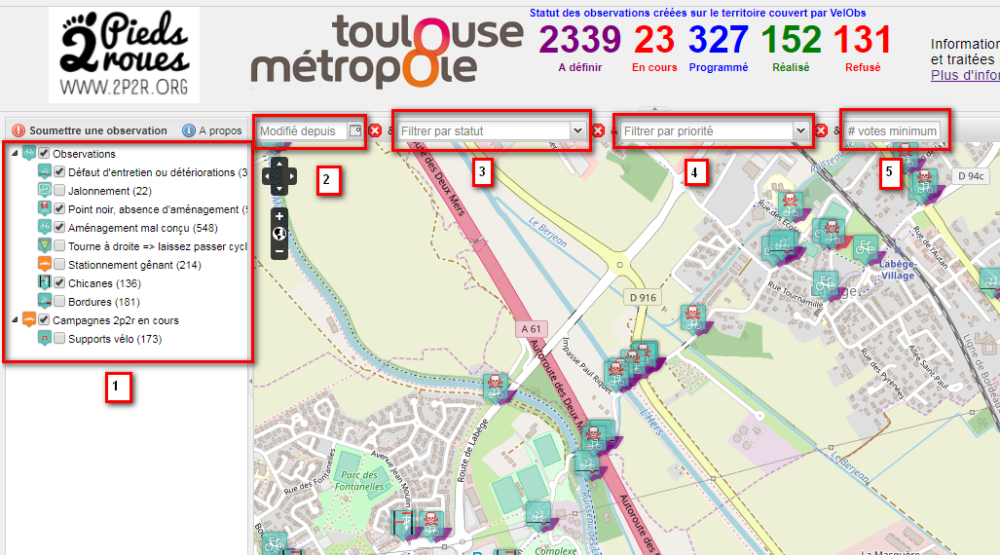

## Modérer et suivre des observations

La modération consiste en la prise en compte des nouvelles observations :

- vérifier que l’observation est valable
- au besoin ajouter une photo, corriger les fautes, enlever les
    insultes, relocaliser l’observation sur la carte…en contactant
    l’observateur si besoin
- Modifier la priorité après analyse de l’observation

Le suivi des observations consiste en la mise à jour des informations et
de la priorité suite aux modifications apportées par la collectivité.

Pour modérer ou assurer le suivi d’une observation, il existe plusieurs
moyens.

### Accès à une interface de modération

#### Suite à réception d’un courriel envoyé par VelObs

Cliquer sur le lien vers l’interface d’administration contenu dans un
courriel reçu après création ou modification d’une observation. Ce lien
est de la forme `URLInstanceVelobs/admin.php?id=XXXX` (ou `XXXX` correspond
au numéro unique de l’observation, e.g.
[http://velobs.2p2r.org/admin.php?id=2916](http://velobs.2p2r.org/admin.php?id=2916)).
Une page web s’ouvre permettant de spécifier ses identifiants **VelObs**

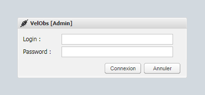

Après avoir cliqué sur le bouton Connexion, la fiche d’administration de
l’observation s’affiche :

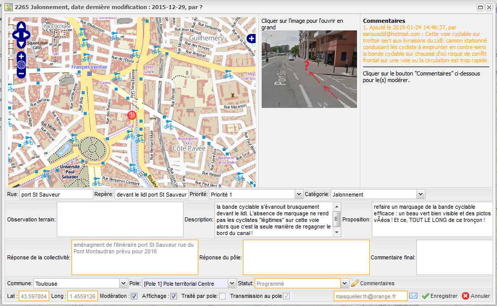

#### Depuis la fiche publique

En affichant la fiche de l’observation sur l’interface publique (clic
sur l’icône de l’observation), un lien vers l’interface d’administration
est accessible, en bas à droite de la fiche :

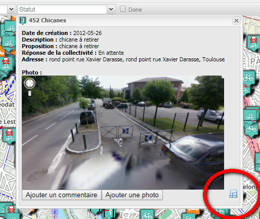

#### Accès direct à l’interface d’administration

Accéder à la page URLInstanceVelobs/admin.php depuis un navigateur.

Après connexion, un tableau listant l’ensemble des observations
s’affiche :

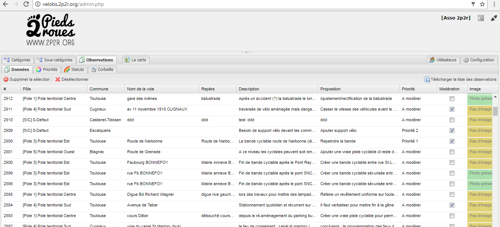

Il est possible de télécharger l’ensemble des observations dans un
fichier .csv, de façon à pouvoir les manipuler dans un tableur
(libreOffice, Excel…). Pour télécharger le .csv, dans l’interface de
modération, il y a un bouton “Télécharger la liste des observations” à
droite du tableau des observations, accessible à toute personne ayant
des identifiants **VelObs**.

En cliquant sur l’onglet « Carte », une carte identique à l’interface
publique s’affiche à la différence que des filtres différents sont
disponibles, permettant notamment d’identifier facilement les
observations à modérer et/ou les observations comportant des
commentaires à modérer.

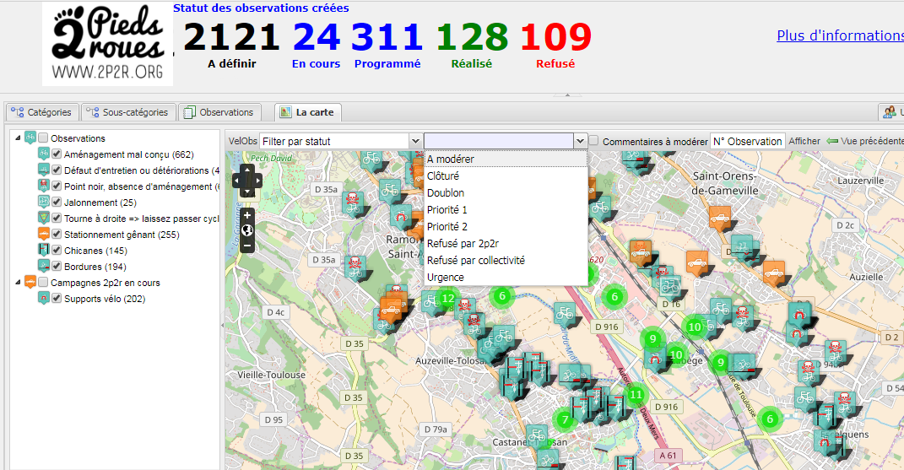

En cliquant sur l’icône d’une observation, la fiche d’administration de
cette observation s’ouvre

### Modification des observations

#### Depuis le tableau

Presque chaque champ est éditable. Pour éditer un champ, il faut double
cliquer dessus.

- Pour chaque champ texte ou liste de choix modifié, il faut cliquer à
    l’extérieur du champ pour que les modifications soient enregistrées.
- Pour les champs “case à cocher”, le simple fait de cliquer dessus
    lance l’enregistrement.

En cliquant sur le bouton “Modérer”, la fiche d’administration de
l’observation s’affiche.

> **Note :** les champs avec le texte bleu sont non modifiables

#### Depuis la fiche d’administration de l’observation

Cette interface permet d’avoir la localisation et la plupart des champs
concernant l’observation, de façon simultanée. Presque chaque champ est
éditable. L’enregistrement ne se fait qu’après avoir cliqué sur le
bouton “Enregistrer”.

> **Note :** les champs avec un liseré orange sont non modifiables. Ces champs
non modifiables varient selon le rôle (modérateur, communauté de
communes, pôle technique) de la personne connectée.

#### Remarques sur les différents champs

1. Observation de Terrain

    Le champ "Observation de Terrain", qui n'est pas public (visible\
    uniquement par les collectivités), permettait de communiquer avec la
    Collectivité en privé. Il sera prochainement supprimé, au profit du
    champ "Commentaire final de l’association" (qui lui est visible sur la
    Carte Publique). Pour assurer le suivi à posteriori, mettre en début du
    commentaire ajouté, la date au format 2017-07-23, en attendant un moyen
    automatisé du suivi des dates de modification.

2. Priorité

    Avec le champ “Commentaire final de l’association”, c’est le champ de
    modération le plus important car il va déterminer le devenir de
    l’observation, son affichage public ou non, ainsi que le déclenchement
    d’envoi de courriels.
    
    - Par défaut, à leur création, les observations ont la priorité "A
        modérer"
    - Si l'observation est importante et/ou à traiter rapidement, on
        lui attribue la priorité "Priorité 1". Automatiquement :
    
        - Courriel envoyé à l’observateur pour le prévenir que son
            observation est prise en compte, avec toutes les
            informations associées à l’observation
        - Affichage de la ligne correspondant à l’observation dans
            l’interface d’administration de la collectivité (il n’y a
            pas de courriel envoyé)
        - Affichage de l’icône de l’observation sur l’interface
            publique
    
    - S'il est question d'aménagement à moyen/long terme on lui
        attribue la priorité "Priorité 2". Automatiquement :
    
        - Courriel envoyé à l’observateur pour le prévenir que son
            observation est prise en compte, avec toutes les
            informations associées à l’observation
        - Affichage de la ligne correspondant à l’observation dans
            l’interface d’administration de la collectivité (il n’y a
            pas de courriel envoyé)
        - Affichage de l’icône de l’observation sur l’interface
            publique
    
    - Si l'observation propose de supprimer un aménagement cyclable
        parce qu'il gêne les voitures, ou si c'est juste des insultes...
        on attribue la priorité "Refusé par l’association"
    
        - Courriel envoyé à l’observateur pour le prévenir que son
            observation ne sera pas transmise à la collectivité, avec
            toutes les informations associées à l’observation
        - Observation non affichée sur l’interface publique
    
    - Si l'observation concerne un problème urgent pouvant être traité
        par un service dédié de la collectivité (verre/gravats sur la
        voie, taille des arbres, danger urgent...), on attribue la
        priorité "Urgence"
    
        - Courriel envoyé à l’observateur pour le prévenir que son
            observation est une urgence avec les coordonnées du service
            d’urgence associé au territoire, avec toutes les
            informations associées à l’observation
        - Observation non affichée sur l’interface publique
    
    - Quand le problème est résolu, on attribue la priorité "Clôturé".
        C'est en effet l’association qui confirme le traitement des
        observations, ce n'est pas la collectivité.
    
        - Courriel envoyé à l’observateur pour le prévenir que son
            observation est clôturé, avec toutes les informations
            associées à l’observation
        - L’icône de l’observation sur l’interface publique passe au
            vert
    
    C'est à ce moment qu'on est content d'avoir passé du temps à s'occuper
    de **VelObs** :D
    
    - Si la collectivité refuse de traiter l'observation, on attribue
            la priorité "Refusé par la collectivité"
    
        - Courriel envoyé à l’observateur pour le prévenir que son
            observation a été refusée par la collectivité, avec toutes
            les informations associées à l’observation
        - L’icône de l’observation sur l’interface publique passe au
            noir
    
3. Commentaires

    A droite de “l’interface tableau” ou en bas à droite de l’interface
    d’administration d’une observation se trouve le champ “Commentaires”. Si
    au moins un commentaire/photo a été ajouté à l’observation, ce champ est
    actif. En cliquant dessus, les commentaires seront affichés dans une
    nouvelle fenêtre, permettant de les modérer :

    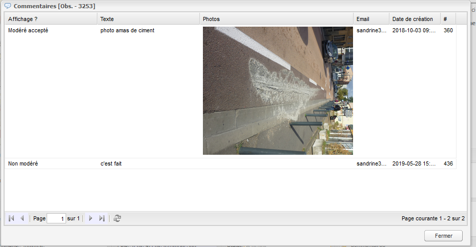
    
    Pour que ces commentaires/photos soient accessibles à la collectivité et
    sur l’interface publique, il faut double-cliquer sur la case “Non modéré” 
    présente dans la colonne “Affichage” et sélectionner “Modéré accepté” ou
    “Modéré refusé” (le commentaire ne sera pas affiché)

## Exporter des observations

Il existe deux méthodes pour exporter des observations :

- génération d'un fichier pdf pour une observation
- génération d'un fichier texte (.csv) pour une multitude d'observations

### Génération d'un fichier pdf

Il est possible de générer un fichier [pdf](doc/velobs_pdf_observation_25.pdf) pour une observation par différents moyens
- `URLInstanceVelobs/lib/public/exportPDF.php?id=XXXX` (ou `XXXX` correspond
au numéro unique de l’observation, e.g.
[http://velobs.2p2r.org/lib/public/exportPDF.php?id=2916](http://velobs.2p2r.org/lib/public/exportPDF.php?id=2916)).
- depuis la fiche publique de l'observation, en cliquant sur l'icône "Imprimante" en bas à droite 
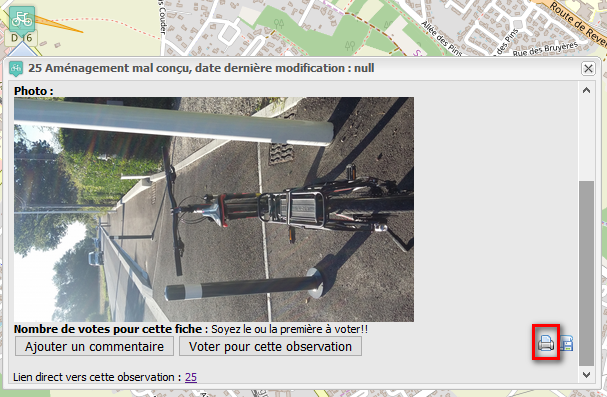
- depuis la fiche d'administration de l'observation, en cliquant sur l'icône "Imprimante" en bas à droite 
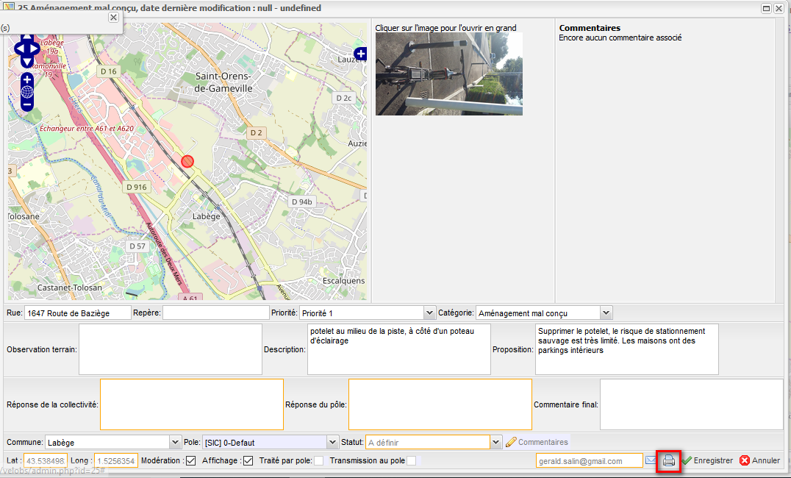
- depuis le tableau d'administration des observations, en cliquant sur le bouton "Imprimer pdf" sur la ligne correspondante à l'observation souhaitée
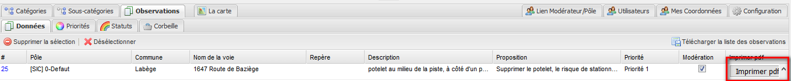

### Génération d'un fichier texte (.csv)

Il est possible de générer un fichier texte (.csv) contenant un ensemble d'observations pour en avoir une vue d'ensemble. Il existe différentes possibilités : 
- depuis l'interface publique, en cliquant sur l'icône verte  
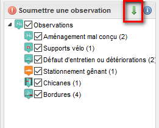 > un formulaire apparaît
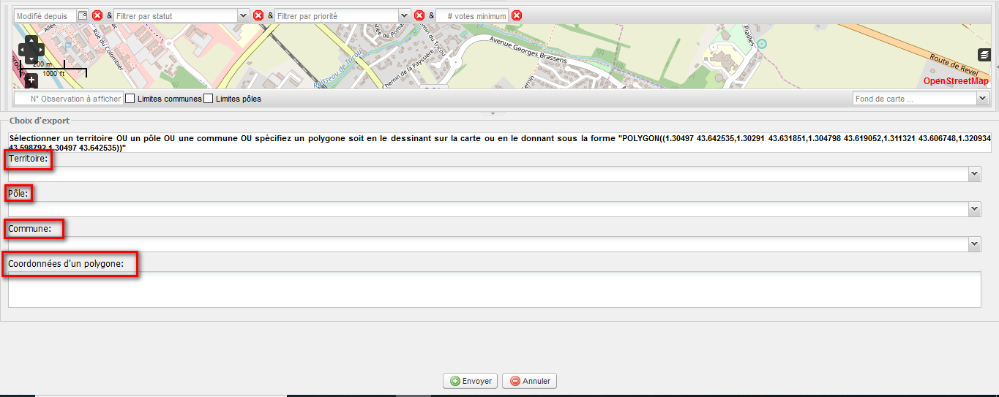
Sélectionner soit un des champs prédéfinis de la base de données
    - Territoire
    - Pôle
    - Commune
soit en donnant la définition d'un polygone correspondant  une zone qui vous intéresse en la collant dans la zone dédiée, soit en dessiant les contours du polygone sur la carte de VelObs : 

    - cliquer sur la carte à l'endroit où vous insérer le premier point du polygone
    - cliquer à un autre endroit de la carte pour positionner le second point du polygone et ainsi de suite
    - fermez votre polygone en double cliquant sur la carte à l'endroit où vous souhaitez créer le dernier point du polygone
    - à ce moment là, le champ "Coordonnées d'un polygone" se rempli automatiquement
    
    Il ne reste plus qu'à cliquer sur le bouton "Valider" pour accéder au fichier csv
     
    
- depuis le tableau d'administration des observations, en cliquant sur le bouton "Télécharger la liste des observations" 
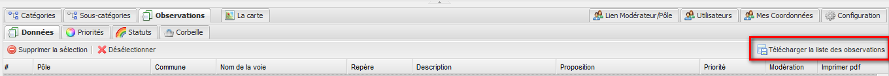

## Prise en compte par la collectivité et les pôles techniques

Les collectivités référencées dans **VelObs** disposent d’identifiants leur
permettant de se connecter à l’interface d’administration. Par exemple,
sur Toulouse Métropole, c’est la personne en charge des modes doux qui
accède régulièrement à **VelObs**.

Après authentification, la collectivité accède à toutes les observations
qui ont été modérées par l’association et qui correspondent à son
territoire.

Elle peut modifier chaque observation pour :

- donner un statut (En cours / Programmé / Refusé / Réalisé),
- ajouter un commentaire dans la colonne “Commentaire de la
    collectivité”
- transmettre au pôle technique correspondant, en cochant la case de
    la colonne “Transmission au pôle”, afin que l’observation soit prise
    en compte sur le terrain

Les pôles techniques référencés dans **VelObs** disposent d’identifiants
leur permettant de se connecter à l’interface d’administration. Après
authentification, le pôle technique accède à toutes les observations qui
ont été modérées par l’association et la collectivité, et qui
correspondent à son territoire.

Il peut modifier chaque observation pour :

- ajouter un commentaire dans le champ “Commentaire du pôle concerné”
- valider la traitement de l’observation en cochant la case de la
    colonne “Traité par pôle”

A chaque modification d’une observation par la collectivité ou un pôle
technique, les administrateurs et modérateurs **VelObs** reçoivent un
courriel avec l’ensemble des informations de l’observation et les champs
qui ont été modifiés, pour faciliter le suivi.

## Gestion des utilisateurs

Les comptes avec le rôle d’administrateur ont la possibilité de

- Créer un nouveau compte en donnant les informations suivantes

    - login : à utiliser pour se connecter à l’interface
        d’administration de **VelObs**
    - mot de passe :
    - le rôle (administrateur / Comcom / Pôle technique / Modérateur)
    - Territoire / Pôle

- Réinitialiser le mot de passe d’un utilisateur en cliquant sur le
    bouton « Réinitialiser » de la ligne correspondante. Un e-mail
    contenant le mot de passe est automatiquement envoyé à l’adresse
    mail du compte correspondant.

> **Note :** il n’est pas possible d’accéder aux mots de passe des comptes
dans **VelObs**, ceux-ci étant chiffrés.

- Désactiver un compte utilisateur en décochant la case dans la
    colonne « Actif » de la ligne correspondante (cocher la case pour
    activer le compte)

    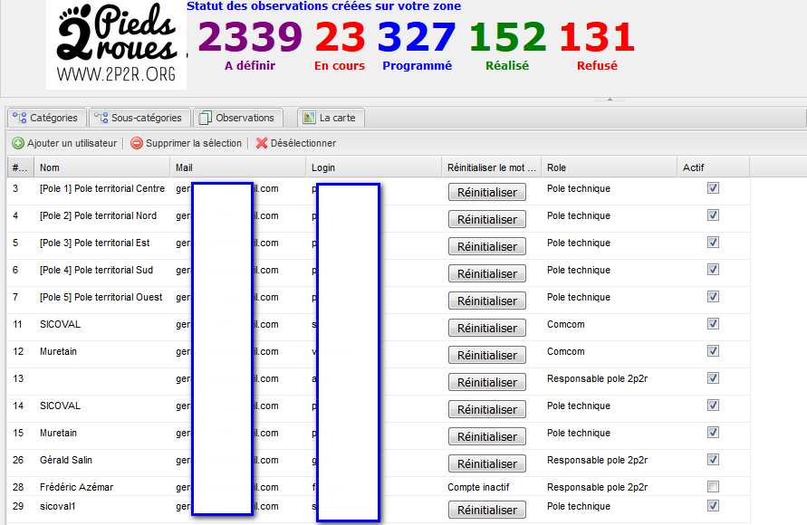 
- Associer/Dissocier un compte « Modérateur » d’un pôle
- La capture d’écran ci-dessous liste les liens entre les comptes et
    les pôles / territoires

    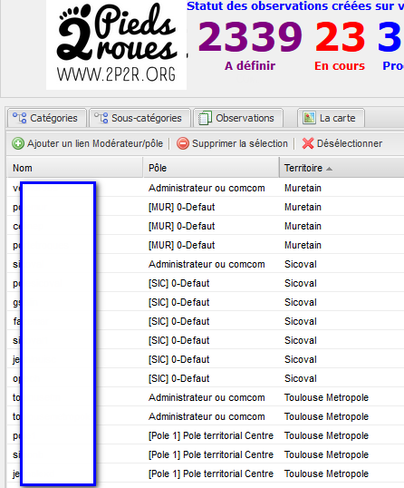

    - Pour associer un compte « Modérateur » à un pôle, il faut
        cliquer sur le bouton « Ajouter un lien Modérateur/Pôle »

        - Sélectionner le compte Modérateur et le pôle à associer
        - Cliquer sur le bouton Enregistrer

             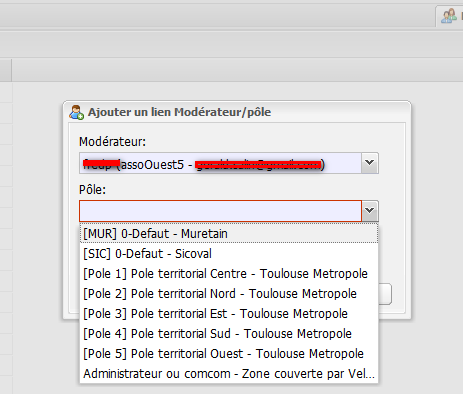 

    - Pour supprimer un lien Modérateur / pôle

        - Sélectionner le lien à supprimer
        - Cliquer sur le bouton « Supprimer la sélection »
        - Valider en cliquant sur le bouton « Oui » de la fenêtre de
            confirmation

            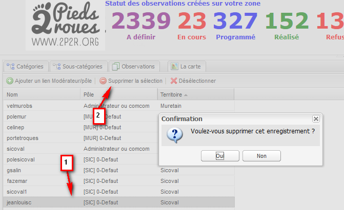

    Chaque compte peut modifier ses informations, y compris le mot de passe,
    en cliquant sur « Mes coordonnées » puis « Modifier mes coordonnées » :

    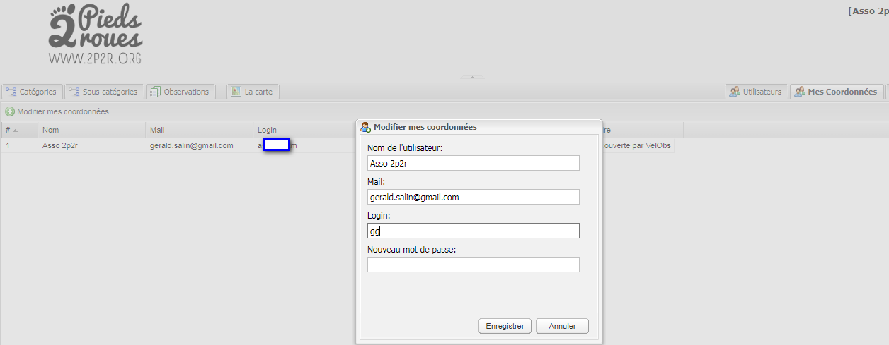

### Suivi des modifications
| Modification                                                                                                                                                                             | Qui ?                                 | Quand ?    |
|------------------------------------------------------------------------------------------------------------------------------------------------------------------------------------------|---------------------------------------|------------|
| Passage en markdown pour une meilleure accessibilité | Johan Dufour johan.dufour@gmail.com | 17/04/2019 |
| Modification paragraphe « Gestion des utilisateurs » pour prendre en compte les nouveautés de la version 1.6.2 : désactivation de comptes, association d’un modérateur à plusieurs pôles | Gérald Salin gerald.salin@gmail.com | 06/02/2019 |
| Ajout paragraphe sur le filtre des observations affichées sur la carte | Gérald salin gerald.salin@gmail.com | 12/02/2019 |
| Correction typos suite retour ADAVA | Gérald salin gerald.salin@gmail.com | 29/04/2018 |
| Ajout du § Gestion des utilisateurs | Gérald Salin gerald.salin@gmail.com | 31/03/3018 |
